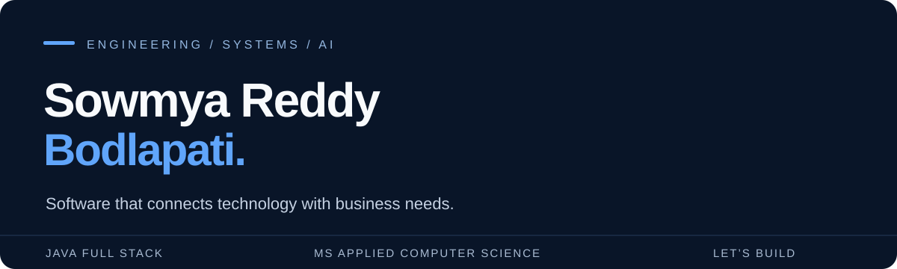

  

  <strong>Java full-stack development · Enterprise applications · AI-assisted delivery</strong> 
  Open to software engineering, technology, and teaching opportunities

  <a href="https://github.com/SowmyaReddy513?tab=repositories">Explore my repositories</a>

---

## Engineering with the business in view

I'm Sowmya, a software engineer with experience in enterprise application development, systems integration, and production support. My work connects Java and Spring Boot services, APIs, databases, and frontend applications with the requirements and workflows they serve.

I have worked on a Walmart client engagement and at Accenture, collaborating with business analysts, QA, DevOps, and technical stakeholders throughout the software delivery lifecycle. I hold an **MS in Applied Computer Science** and am pursuing a **DBA with an IT Management specialization** at Belhaven University.

## What I work with

| Area | Technologies and practices |
| :--- | :--- |
| Backend and integration | Java, Spring Boot, Spring MVC, REST APIs, Apache Kafka, microservices |
| Frontend | Angular, React, JavaScript, TypeScript, HTML, CSS |
| Data and cloud | SQL, PostgreSQL, MySQL, MongoDB, Azure, AWS |
| Delivery and quality | Git, Jenkins, Azure DevOps, Docker, Kubernetes, JUnit, Mockito |
| Applied AI | AI-assisted coding and testing, prompt engineering, LLM workflows; working knowledge of embeddings and RAG patterns |
| Collaboration | Requirements analysis, Agile/Scrum, technical documentation, UAT and release coordination |

## Explore the code

These repositories collect my development practice and project work. Each link opens the source; they are not claims of production deployments.

| Repository | Focus |
| :--- | :--- |
| [LibraryApplication](https://github.com/SowmyaReddy513/LibraryApplication) | Java application repository with a Maven project structure |
| [veggiebarter-admin](https://github.com/SowmyaReddy513/veggiebarter-admin) | TypeScript repository |
| [SpringWeb](https://github.com/SowmyaReddy513/SpringWeb) | Java and Spring web development practice |
| [CoreJava](https://github.com/SowmyaReddy513/CoreJava) | Java fundamentals |
| [BMI_iOSApp](https://github.com/SowmyaReddy513/BMI_iOSApp) | Swift application repository |

## Experience and education

**Software Engineer — Walmart client engagement**  
February 2024 – August 2026  
Java/Spring Boot services, Angular interfaces, API and database integrations, cross-team troubleshooting, technical documentation, and release support.

**Application Development Associate — Accenture**  
August 2021 – July 2022  
Spring Boot microservices, Kafka integrations, requirements analysis, testing, and application modernization support.

**DBA, IT Management specialization** — Belhaven University · August 2026 – present  
**MS, Applied Computer Science** — Northwest Missouri State University · December 2023  
**BTech, Computer Science and Engineering** — Narasaraopeta Engineering College · July 2021

## Where I want to contribute

Software engineering, business and systems analysis, IT project coordination, and applied AI. I am also interested in computing instruction, tutoring, and technology-focused volunteer work where my education and experience fit the role.

Build clearly. Document decisions. Keep learning.

